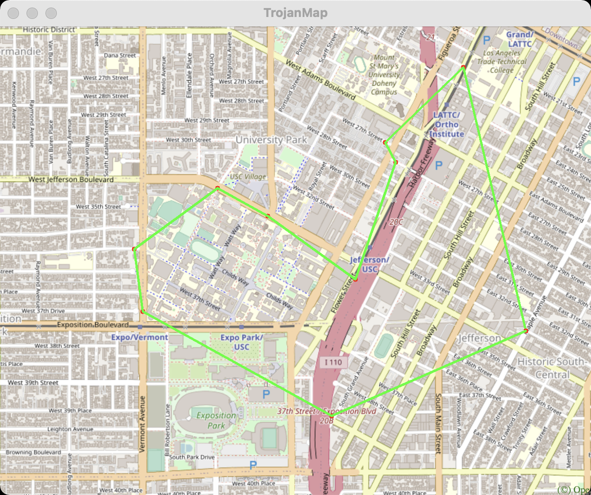

# EE538 Final Project - Trojan Map #

Instructor: [Arash Saifhashemi](https://viterbi.usc.edu/directory/faculty/Saifhashemi/Arash), Fall 2021, University of Southern California.

## Overview of Trojan Map

In this project, we built a Trojan Map application based on STL data structure and various graph searching algorithms, which can implement following functionalities:

* Autocomplete the location name in the map (ignroring uppercase or lower case)
* Find the place's Coordinates in the map
* Figure out the most optimal route between two locations
* Calculate best routes for travelers on a permutation of locations (The Traveling Salesman Problem)
* Find if there exists a cycle path in the subgraph (Cycle detection)
* Given some certain visiting orders of places, figure out the feasible route (Topological sort)
* Find k closest places around a certain location
* **EXTRA**: Genetic algorithm implementation for Travelling Trojan
* **EXTRA**: Create dynamic and animated UI using ncurses

Data used: 2238 coordinate points around the University of Southern California area

Language based: C++

### Simple Demo

<p align="center"></p>

<p align="center"></p>

## Data Structure

Each point on the map is represented by the class **Node** shown below and defined in [trojanmap.h](src/lib/trojanmap.h).

```cpp
class Node {
  public:
    std::string id;    // A unique id assign to each point
    double lat;        // Latitude
    double lon;        // Longitude
    std::string name;  // Name of the location. E.g. "Bank of America".
    std::vector<std::string>
        neighbors;  // List of the ids of all neighbor points.
};

```

### Tools & Platforms

Vmware , Ubuntu VM, CLion, Bazel, GTest, Opencv

## Steps to run the program

#### Clone the project

Please clone this repo on your computer

```shell
$ git clone https://github.com/yangziqi1998666/Trojan_Map_App
$ cd https://github.com/yangziqi1998666/Trojan_Map_App
```

#### OpenCV Installation

For visualization, we used [OpenCV](https://github.com/opencv/opencv) library as a black box. 

Use the following commands to install OpenCV.

For Ubuntu:

```shell
$ sudo apt-get install cmake libgtk2.0-dev pkg-config
$ sudo apt install libcanberra-gtk-module libcanberra-gtk3-module
$ sudo apt-get install libncurses5-dev libncursesw5-dev
$ cp ubuntu/* ./
```

For MacOS:

```shell
$ brew install cmake
$ brew install ncurses
```

Next, type the following, but make sure that you set the **path_to_install_folder** to be the absolute path to the install folder under opencv.

```shell
$ cd opencv/
$ mkdir build install
$ cd build
$ cmake -D CMAKE_INSTALL_PREFIX=/Users/ziqiyang/EE538/final-project-yangziqi1998666-master/opencv/install\
 -D BUILD_LIST=core,highgui,imgcodecs,imgproc,videoio\
 -D WITH_TBB=ON -D WITH_OPENMP=ON -D WITH_IPP=ON\
 -D CMAKE_BUILD_TYPE=RELEASE -D BUILD_EXAMPLES=OFF\
 -D WITH_NVCUVID=ON\
 -D WITH_CUDA=ON\
 -D BUILD_DOCS=OFF\
 -D BUILD_PERF_TESTS=OFF\
 -D BUILD_TESTS=OFF\
 -D WITH_CSTRIPES=ON\
 -D WITH_OPENCL=ON ..
$ make install
```

#### Bazel Build

Please run:

```shell
$ bazel run src/main:main
```

If everything is correct, this menu will show up.

<p align="center"></p>

### Google Test

Functionalities of the program will be tested via [GTest](https://github.com/google/googletest) & [Bazel](https://docs.bazel.build/versions/master/bazel-overview.html).

Please run:

```shell
$ bazel test tests::tests
```

<p align="center"></p>

## Function 1: Autocomplete the location name

```c++
std::vector<std::string> Autocomplete(std::string name);
```

* We consider the names of nodes as the locations. Implement a method to type the partial name of the location and return a list of possible locations with partial name as prefix.  Uppercase and lower case are treated as the same character.
* We use function [transform](https://www.cplusplus.com/reference/algorithm/transform/?kw=transform) and [::tolower](https://www.cplusplus.com/reference/cctype/tolower/) to change input name and all location names into lower case.
* The **time complexity** for this function is O(n) where n is the number of nodes.

```C++
std::vector<std::string> TrojanMap::Autocomplete(std::string name){
  ...
  for(auto it: data){
    if(it->second.name.length()>=name.length()){
      ...
      if(temp.substr(0,name.length())==name){
        ...
      }
  ...
}
```

Example:

Input: "ta" \
Output: ["Target", "Tap Two Blue"]

<p align="center"></p>

## Function 2: Find the place's Coordinates in the Map

```C++
std::pair<double, double> GetPosition(std::string name);
```

* Given a location, search for its latitude and longitude and mark the map's locations. If the location does not exist, return (-1,-1)

- Helper functions ***GetLat*** and ***GetLon*** are used to extract values of latitude and longitude, respectively.
- The **time complexity** of this function is O(n), where n is the number of nodes.

Example:

Input: "Ralphs" 
Output: (34.0317653, -118.2908339)

<p align="center"></p>

## Function 3: CalculateShortestPath between two places

```C++
std::vector<std::string> CalculateShortestPath_Dijkstra(std::string &location1_name,
                                               std::string &location2_name);
std::vector<std::string> CalculateShortestPath_Bellman_Ford(std::string &location1_name,
                                               std::string &location2_name);
```

* Given 2 locations A and B, find the best route from A to B. The distance between 2 points is the euclidean distance using latitude and longitude.
* Use both [Dijkstra algorithm](https://en.wikipedia.org/wiki/Dijkstra%27s_algorithm) and [Bellman-Ford algorithm](https://en.wikipedia.org/wiki/Bellman%E2%80%93Ford_algorithm). Compare the time for the different methods. Show the routes on the map. If there is no path, please return empty vector.
* The **time complexity** of Dijkstra is **O(E logV)**. [Greedy](https://www.geeksforgeeks.org/greedy-algorithms/) approach is taken to implement the algorithm.
* The **tiem complexity** of Bellman-Ford algorithm is **O(VE)**. [Dynamic Programming](https://www.geeksforgeeks.org/dynamic-programming/) approach is taken to implement the algorithm.

Examples:

Input: "Ralphs", "ChickfilA"

Output:

```shell
*************************Results of Dijkstra***********************
The distance of the path is:1.53852 miles
Time taken by function(Dijkstra): 503195 microseconds

**************************************************************
*************************Results of Bellman-Ford****************
The distance of the path is:1.53852 miles
Time taken by function(Bellman Ford): 18602773 microseconds

**************************************************************
```

Input: "Ralphs", "USC Parking"

Output:

```shell
*************************Results of Dijkstra***********************
The distance of the path is:1.08442 miles
Time taken by function(Dijkstra): 254305 microseconds

**************************************************************
*************************Results of Bellman-Ford****************
The distance of the path is:1.08442 miles
Time taken by function(Bellman Ford): 18308147 microseconds

**************************************************************
**************************************************************
```

Input: "USC Parking", "CVS"

Output:

```shell
* 3. CalculateShortestPath                                    
**************************************************************
Please input the start location:USC Parking
Please input the destination:CVS
*************************Results of Dijkstra***********************
The distance of the path is:0.0778914 miles
Time taken by function(Dijkstra): 16410 microseconds
**************************************************************
*************************Results of Bellman-Ford****************
The distance of the path is:0.0778914 miles
Time taken by function(Bellman Ford): 18467462 microseconds
*************************************************************
```

* From **comparison** between Dijkstra and Bellman Ford in some cases, we can find that the Bellman Ford is much slower than Dijkstra.

<p align="center"></p>

<p align="center"></p>

## Function 4: The Traveling Trojan Problem

- Assumed the map is a [complete graph](https://www.geeksforgeeks.org/graph-types-and-applications/), which means each location is a neighbor of all other locations.
- Given a vector of location ids, assume every location can reach every location in the list.
- The shortest route that covers all the locations and goes back to the start point. Return the shortest route and it will be converted to a animation.

Example:

Input: 10

Output: 

<p align="center"></p>

<p align="center"></p>

### Brute Froce Approach: [DFS Recursion](https://www.geeksforgeeks.org/travelling-salesman-problem-implementation-using-backtracking/)

```c++
std::pair<double, std::vector<std::vector<std::string>>> TravellingTrojan(
      std::vector<std::string> &location_ids);
```

<p align="center"></p>

```C++
void TrojanMap::TravellingTrojan_helper(std::vector<std::string> &ids, std::pair<double, std::vector<std::vector<std::string>>> &results,
                    bool visited[], std::vector<std::string> &path, double &min_dist, double dist) 
```

### [2-opt Heuristic](https://en.wikipedia.org/wiki/2-opt). Also see [this paper](http://cs.indstate.edu/~zeeshan/aman.pdf)

```C++
std::pair<double, std::vector<std::vector<std::string>>> TravellingTrojan_2opt(
      std::vector<std::string> &location_ids);
```

* Optimal TSP solution is NP-hard, Heuristic algorithms used to **approximate** solution
* We use 2-opt improvement heuristic
  * Generate k random initial places 
  * Iteratively improve path until local minimum reached

* In each iteration, apply best possible 2-opt move. Find best pair of edges (i,i+1) and (j,j+1) such that replacing them with (i,j) and (i+1,j+1) minimizes path length

```C++
void TrojanMap::TravellingTrojan_2opt_helper(vector<std::string> &path, int start, int end){
    1. take route[0] to route[i-1] and add them in order to new_route
    2. take route[i] to route[k] and add them in reverse order to new_route
    3. take route[k+1] to end and add them in order to new_route
    return new_route;
}
```

### Comparasion

When input is 5:

```
**************************************************************
The distance of the path by Backtracking is:2.26423 miles
The distance of the path by 2-opt Heuristic is:2.26423 miles
**************************************************************
Time taken by function Backtracking is: 172 microseconds
Time taken by function 2-opt Heuristic is: 47608 microseconds
**************************************************************                  
```

When input is 7:

```
**************************************************************
The distance of the path by Backtracking is:4.10696 miles
The distance of the path by 2-opt Heuristic is:4.10696 miles
**************************************************************
Time taken by function Backtracking is: 2403 microseconds
Time taken by function 2-opt Heuristic is: 65924 microseconds5
**************************************************************
```

When input is 10:

```
**************************************************************
The distance of the path by Backtracking is:4.57017 miles
The distance of the path by 2-opt Heuristic is:5.03414 miles
**************************************************************
Time taken by function Backtracking is: 195427 microseconds
Time taken by function 2-opt Heuristic is: 135171 microseconds
**************************************************************
```

When input is 13

```
**************************************************************
The distance of the path by Backtracking is:5.65973 miles
The distance of the path by 2-opt Heuristic is:6.65234 miles
**************************************************************
Time taken by function Backtracking is: 28675913 microseconds
Time taken by function 2-opt Heuristic is: 295099 microseconds
**************************************************************
```

When input is 15

```
**************************************************************
The distance of the path by Backtracking is:5.49 miles
The distance of the path by 2-opt Heuristic is:7.05338 miles
**************************************************************
Time taken by function Backtracking is: 114936187 microseconds
Time taken by function 2-opt Heuristic is: 287997 microseconds
**************************************************************
```

### Conclusion

* 2-opt algorithm may not get the optimal solution.
* When the input is small, like 5 or 7, the time spent by backtracking is less than the 2-opt heuristic. When the input is getting larger, the time spent by backtracking will soon surpass the 2-opt heuristic, it it will turn into a huge number when input is larger than 13.
* The **time complexity** of Brute Force is **O(n^2)**.
* The **time complexity** of 2-opt Heuristic is **O(n*x)**, where x is the times of non_improvments defined by users.

## Function 5: Cycle Detection

```c++
bool TrojanMap::CycleDetection(std::vector<double> &square)
```

* we use a square-shaped subgraph of the original graph by using four coordinates stored in ```std::vector<double> square```, which follows the order of left, right, upper, and lower bounds. 

* Try to determine if there is a cycle path in the that subgraph. If it does, return true and report that path on the map. Otherwise return false.

* The **time complexity** of this function is **O(n^2)**.

```C++
bool TrojanMap::CycleDetection_helper(string &id, string &parent, unordered_map<string, bool> &visited, vector<string> &ids, vector<double> &square, vector<vector<string>> &vv)
```

Example:

```shell
Input: square = {-118.299, -118.264, 34.032, 34.011}
Output: true
```

<p align="center"></p>

## Function 6: Topological Sort

```C++
std::vector<std::string> TrojanMap::DeliveringTrojan(std::vector<std::string> &locations, std::vector<std::vector<std::string>> &dependencies)
```

* Tommy Trojan got a part-time job from TrojanEats, for which he needs to pick up and deliver food from local restaurants to various location near the campus. Tommy needs to visit a few different location near the campus with certain order, since there are some constraints. For example, he must first get the food from the restaurant before arriving at the delivery point. 
* Taojan Map app will figure out the optimal path ordered by certain constraints.
* Use queue to calculate the indegree each node

<p align="center"></p>

Example:

```shell
Input: 
location_names = {"Cardinal Gardens", "Coffee Bean1", "CVS"}
dependencies = {{"Cardinal Gardens","Coffee Bean1"}, {"Cardinal Gardens","CVS"}, {"Coffee Bean1","CVS"}}
```

Output:

<p align="center"></p>

## Function 7: Find K closest points

```C++
std::vector<std::string> TrojanMap::FindKClosestPoints(std::string name, int k) 
```

* Given a location name and a integer k , find the k closest locations with name on the map and return a vector of string ids.
* Backtracking

* The main idea is [Quick Selection algorithm](https://www.geeksforgeeks.org/quickselect-algorithm/). Quick Select is a **variation** of the quicksort algorithm. It is an optimized way to find the kth smallest/largest element in an unsorted array.
* The **time complexity** of this function is **O(n log n)** in best case and **O(n^2)** in the worst case.

```C++
void TrojanMap::FindKClosestPoints_(std::vector<Node>& nameData, int left, int right, int k, std::string souceId)
```

<p align="center"></p>

Example1:

```shell
Please input the locations:USC Parking
Please input k:5
*************************Results******************************
Find K Closest Points Results:
1 CVS
2 Cal Mart Beer 38 Wine Food Store
3 Residence Inn
4 Car Pooling station
5 Safety Pole
**************************************************************
Time taken by function: 9563 microseconds
```

<p align="center"></p>

Example2:

```
Please input the locations:Ralphs
Please input k:10
*************************Results******************************
Find K Closest Points Results:
1 St Agnes Church
2 Saint Agnes Elementary School
3 Warning Skate Shop
4 Menlo AvenueWest Twentyninth Street Historic District
5 Vermont Elementary School
6 MC39s Barber Shop
7 Anna39s Store
8 Vermont 38 29th Metro 204 Southbound
9 Driveway
10 Vermont 38 29th Metro 204 Northbound
**************************************************************
Time taken by function: 9642 microseconds
```

<p align="center"></p>

## Extra credit items

### [Genetic algorithm](https://www.geeksforgeeks.org/traveling-salesman-problem-using-genetic-algorithm/) implementation for Travelling Trojan

```C++
std::pair<double, std::vector<std::vector<std::string>>> TrojanMap::TravellingTrojan_genetic(std::vector<std::string> &location_ids)
```

A genetic algorithm is a search heuristic that is inspired by Charles Darwin's theory of natural evolution. This algorithm reflects the process of natural selection where the fittest individuals are selected for reproduction in order to produce offspring of the next generation.

<p align="center"></p>

The process of natural selection starts with the selection of fittest individuals from a population. They produce offspring which inherit the characteristics of the parents and will be added to the next generation. If parents have better fitness, their offspring will be better than parents and have a better chance at surviving. This process keeps on iterating and at the end, a generation with the fittest individuals will be found.

Five phases are considered in a genetic algorithm.

1. Initial population
2. Fitness function
3. Selection
4. Crossover
5. Mutation

In the code are designed as follows:

```C++
void init_group(std::vector<std::string> &location_ids,int placenum)
void calculation(int placenum);
void savebest(int placenum);
void change_bestgroup(int placenum);
void select(int placenum);
void crossover(int placenum);
void mutation(int placenum);
```

Example:

Input:10
Output:

<p align="center"></p>

As we can see, the efficiency of genetic algorithm is higher than backtracking and 2-opt. However, since the generation I set is limited to 1000, the outcome is not the optimal path.

<p align="center"></p>

The **time complexity** of this algorithm is **O(P * G * O(Fitness) * ((Pc * O(crossover)) + (Pm * O(mutation))))**, where P is the population size, G is the generations(I set 1000), Pc is the crossover probability(I set 0.5),Pm is the mutation probability(I set 0.2).

### Create dynamic and animated UI using [ncurses](https://en.wikipedia.org/wiki/Ncurses)

**ncurses** (new [curses](https://en.wikipedia.org/wiki/Curses_(programming_library))) is a [programming library](https://en.wikipedia.org/wiki/Library_(computer_science)) providing an [application programming interface](https://en.wikipedia.org/wiki/Application_programming_interface) (API) that allows the programmer to write [text-based user interfaces](https://en.wikipedia.org/wiki/Text-based_user_interface) in a terminal-independent manner. It is a toolkit for developing "[GUI](https://en.wikipedia.org/wiki/GUI)-like" [application software](https://en.wikipedia.org/wiki/Application_software) that runs under a [terminal emulator](https://en.wikipedia.org/wiki/Terminal_emulator). It also optimizes screen changes, in order to reduce the [latency](https://en.wikipedia.org/wiki/Latency_(engineering)) experienced when using remote [shells](https://en.wikipedia.org/wiki/Unix_shell).

**Reference**: https://github.com/ourarash/ncurses_bazel

**The main function of ncurses:**

```shell
initscr();
getyx();
getstr();
mvprintw();
endwin();
```

I set three modes of displaying color:

```shell
    init_pair(1, COLOR_RED, COLOR_GREEN); // wrong
    init_pair(2, COLOR_GREEN, COLOR_BLUE); // byebye
    init_pair(3, COLOR_YELLOW, COLOR_BLACK); // normal
```

**Note:** When you finish testing a function, you can press any key to continue!

Example:

<p align="center"></p>

<p align="center"></p>

<p align="center"></p>

## Conclusion

In this project, we implemented a map application backend system for users to navigate around the USC campus. We accomplish the basic function of a mapping application:  the autocomplete the location name, find the shortest path, find the optimal one turn path ,etc.

Some basic STL libraries we used include: vector, unordered_map, list, queue, etc. Involving graph algorithms are DFS, BFS, Dijikstra, Bellman Ford, 2-opt Heuristic ...

Also, the application accomplish the function of basic animations of mapping.

## Further works

As to Traveling salesman problem, although we improve it by using 2-opt Heuristic, we will try to use the [3-opt](http://cs.indstate.edu/~zeeshan/aman.pdf) to find a more optimal way solving this problem.
